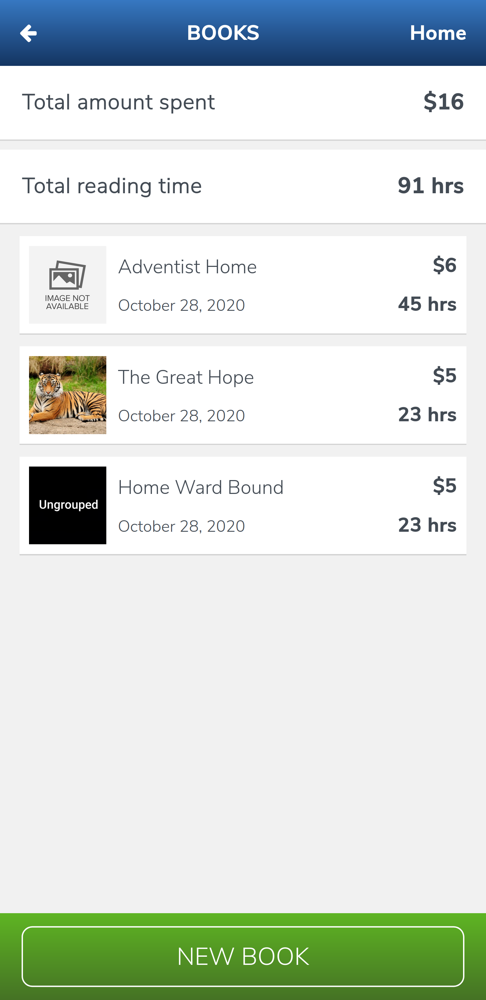
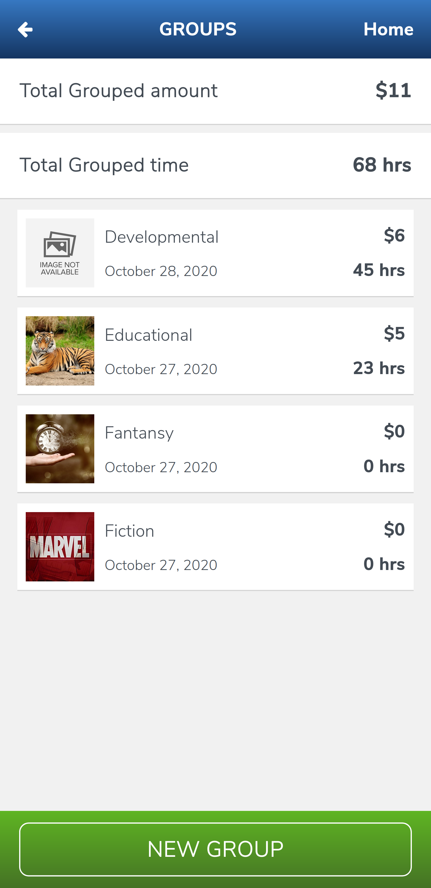
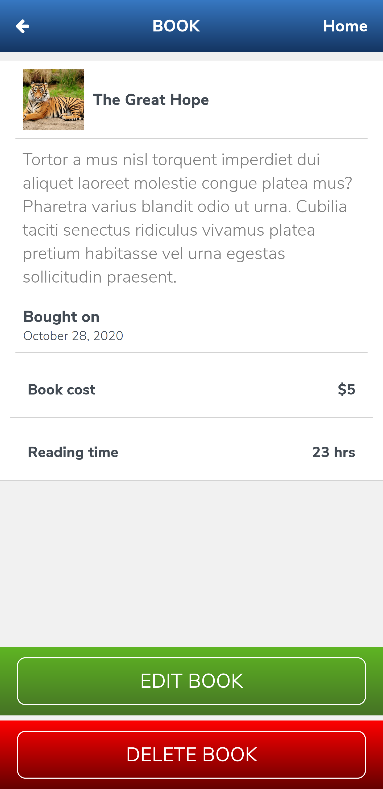

# Literature Tracker

## Project Description

This project is a web tracker application for BOOKS built with Ruby on Rails demonstrating learned concepts in the rails section of the [Microverse program](https:www.microverse.org).

It involves tracking the books a registered User buys, the cost of each book, and how much time was spent reading a particular book.

The project also includes a number of features such as User sign up and sign in, creating groups, assigning books to a group and viceversar, amoung others.

**NOTE:** The project has a `Mobile-only` lay out.

### Screenshots

|Profile Page|Books Page
|-|-|
|||

|Groups page|Book Details|
|-|-|
||

## Built With

- Ruby 2.7.1
- Ruby on Rails 5.2.4.3
- Postgresql 10.14

## Tested with
- Rspec
- Capybara

## Get Started

### Prerequisites
1. You should have ruby installed.(This project was tested on version `2.7.1`)
1. You should have rails installed.(This project was tested on version `5.2.4.3`)
1. You should have bundler installed.(This project was tested with Bundler version `2.1.4`)
1. You should have Postgresql installed.(This project was built with version `10.4`)

   
### Steps to follow
1. Clone the repository to your local machine using `git clone git@github.com:RNtaate/Literature-Tracker.git`
1. On your local machine, navigate to the Literature-Tracker folder using `cd Literature-Tracker` in your terminal
1. Install all the gems for the project by running `bundle` in your terminal
1. Create database using the following command `rails db:create`
1. Migrate the database using the following command
`rails db:migrate`
1. Start the server by using the following command.
`bin/rails server`

1. Open this link in your favorite browser `http://localhost:3000`

## Testing the project

### Pre-requisites
- `Image Magick` must be installed

### Instructions
1. Clone the repository to your local machine using `git clone git@github.com:RNtaate/Literature-Tracker.git`
1. On your local machine, navigate to the Literature-Tracker folder using `cd Literature-Tracker` in your terminal
1. Create a new branch using `git checkout -b testing_branch`
1. Run `bundle install`
1. run `rspec`

## Live Demo

- [Literature Tracker](https://thawing-reaches-37049.herokuapp.com/)

## Contributions

  There are two ways of contributing to this project:

1.  If you see something wrong or not working, please check [the issue tracker section](https://github.com/RNtaate/Literature-Tracker/issues), if that problem you met is not in already opened issues then open the issue by clicking on `new issue` button.

2.  If you have a solution to that, and you are willing to work on it, follow the below steps to contribute:
    1.  Fork this repository
    1.  Clone it on your local computer by running `git clone git@github.com:RNtaate/Literature-Tracker.git` __Replace *RNtaate* with the username you use on github__
    1.  Open the cloned repository which appears as a folder on your local computer with your favorite code editor
    1.  Create a separate branch off the *master branch*,
    1.  Write your codes which fix the issue you found
    1.  Commit and push the branch you created
    1.  Raise a pull request, comparing your new created branch with our original master branch [here](https://github.com/RNtaate/Literature-Tracker)

## Authors

👤 **Roy Ntaate**

- Github: [@RNtaate](https://github.com/RNtaate)
- Twitter: [@RNtaate](https://twitter.com/RNtaate)
- Linkedin: [roy-ntaate](https://linkedin.com/in/roy-ntaate)

## Show your support

Give a ⭐️ if you like this project!

## Acknowledgments
- The UI Design credit goes to [Gregoire Vella at www.behance.net](https://www.behance.net/gallery/19759151/Snapscan-iOs-design-and-branding?tracking_source=)
- This project was inspired by the [Microverse](https:www.microverse.org) program
